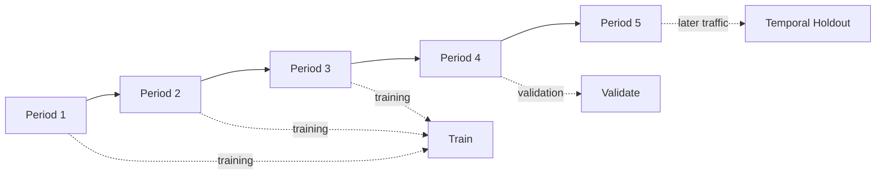
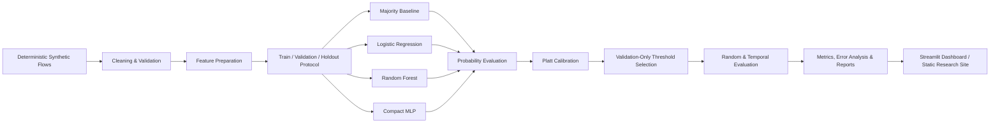

<div align="center">

# ThreatShift

### Evaluating ML-Based Intrusion Detection Under False-Alarm Constraints and Temporal Shift

A reproducible machine-learning study of network intrusion detection that measures attack recall, false alarms, calibration, and robustness to later traffic under a controlled synthetic network-flow scenario.

[](https://www.python.org/)
[](https://scikit-learn.org/)
[](https://pytorch.org/)
[](https://streamlit.io/)

**[Live Research Website](https://hasankhan05.github.io/ThreatShift/)** · **[GitHub Repository](https://github.com/HasanKhan05/ThreatShift)**

</div>

---

## Overview

ThreatShift studies a practical intrusion-detection question:

> **Can a machine-learning detector catch more attacks without creating an unacceptable number of false alarms, and does that balance hold when later traffic shifts?**

The project compares four classifiers on the same reproducible network-flow study:

- Majority baseline
- Logistic Regression
- Random Forest
- Compact MLP

The selection rule is defined before model comparison: **maximize attack recall among models whose false-positive rate (FPR) is at or below 10%**.

Unlike a production IDS, ThreatShift is a research and evaluation environment. It does not capture live network traffic or claim to represent enterprise traffic. The dataset is generated locally and deterministically so the full experiment can be reproduced, inspected, and tested.

---

## Measured Result

The canonical experiment selects **Logistic Regression** under the predefined `FPR <= 10%` rule.

| Model | Attack Recall | False-Positive Rate |
|---|---:|---:|
| Majority Baseline | 0.0% | 0.0% |
| **Logistic Regression** | **50.2%** | **9.5%** |
| Random Forest | 45.2% | 8.5% |
| Compact MLP | 49.5% | 9.5% |

The majority baseline is intentionally useful as a sanity check: predicting the majority `BENIGN` class for every flow produces **0% attack recall and 0% FPR**. It creates no false alarms because it never raises an alert, but it also detects no attacks.

These are measured experiment outputs, not presentation values. The public site is backed by a committed website-facing snapshot derived from the reproducible experiment artifacts.

> Random-split and chronological holdout results are kept separate. ThreatShift does not combine them into a single mixed benchmark.

---

## Why This Evaluation Matters

Accuracy alone is not a sufficient metric for intrusion detection. A detector can look strong on an imbalanced dataset while still missing attacks or overwhelming an analyst with false positives.

ThreatShift therefore emphasizes:

- **Attack recall** — how many attacks are detected.
- **False-positive rate** — how often benign traffic is incorrectly flagged.
- **Recall at a fixed FPR budget** — attack detection under an operationally meaningful false-alarm constraint.
- **Macro-F1** — class-balanced classification quality.
- **PR-AUC** — useful when the positive class is less common.
- **ROC-AUC** — included as a secondary discrimination metric.
- **Brier score and ECE** — probability calibration quality.
- **Temporal holdout evaluation** — performance on later traffic after controlled distribution shift.
- **Seed variation** — sensitivity to repeated experimental runs.

---

## Dataset

ThreatShift uses a **deterministic synthetic network-flow dataset** designed for reproducible IDS experiments.

| Property | Value |
|---|---|
| Valid flows | 12,000 |
| Planned cleaning defects | 44 |
| Raw generated rows | 12,044 |
| Numeric ML features | 16 |
| Chronological periods | 5 |
| Target | `BENIGN` / `ATTACK` |

The 44 planned defects are intentionally inserted to exercise the cleaning pipeline:

- 8 missing-label rows
- 12 non-finite feature rows
- 24 duplicate rows

Attack-family labels are used for analysis and slicing rather than as ML input features. The scenario includes controlled families such as denial-of-service, scanning, credential abuse, and web exploitation.

### Temporal design

The five periods support both ordinary evaluation and later-traffic testing:



Periods 4 and 5 introduce controlled shift so the project can test whether performance changes when the traffic distribution moves beyond the earlier training periods.

---

## Experimental Pipeline



Important safeguards include:

- preprocessing and resampling are fit only on training data;
- calibration is fit on validation predictions;
- threshold selection uses validation data only;
- test and temporal holdouts are evaluated after model selection;
- identifiers, timestamps, IP addresses, attack-family labels, capture period, and row order are excluded from the ML feature set;
- experiment artifacts include provenance and checksums.

---

## Models

### Majority Baseline

Always predicts the majority class. It provides a simple reference showing why low FPR alone is not enough.

### Logistic Regression

A linear probabilistic classifier trained with class balancing. In the canonical experiment, it provides the strongest qualifying attack recall under the 10% FPR budget.

### Random Forest

A tree ensemble used as a nonlinear baseline.

### Compact MLP

A small CPU-trained PyTorch network:

```text
16 inputs
  ↓
24-unit hidden layer
  ↓
ReLU
  ↓
1 output logit
```

The MLP uses validation-only early stopping.

---

## Repository Structure

```text
ThreatShift/
├── configs/                     # Dataset, scenario, model and experiment configuration
├── data/
│   └── synthetic/               # Versioned deterministic synthetic fixture + provenance
├── demo/                        # Saved replay examples and demo evidence
├── docs/                        # GitHub Pages research presentation website
├── reports/                     # Research report and experiment documentation
├── scripts/                     # Website/export and supporting utilities
├── src/
│   ├── app/                     # Streamlit research dashboard
│   ├── cyberattack_detection/   # Reproduction / experiment orchestration
│   ├── data/                    # Synthetic generation and validation
│   ├── evaluation/              # Metrics, calibration and analysis
│   ├── features/                # Feature preparation
│   └── models/                  # Baselines and ML models
├── tests/                       # Unit, integration and release/reproducibility tests
├── README.md
└── uv.lock
```

Generated experiment outputs are written under `artifacts/` and are intentionally treated as local evidence rather than source files.

---

## Tech Stack

| Area | Technologies |
|---|---|
| Language | Python 3.11+ |
| Classical ML | scikit-learn |
| Neural Network | PyTorch (CPU) |
| Data | pandas, NumPy, PyArrow |
| Resampling | imbalanced-learn |
| Explainability | SHAP |
| Research UI | Streamlit |
| Plotting | Matplotlib |
| Configuration | YAML / PyYAML |
| Testing | pytest |
| Linting | Ruff |
| Type Checking | mypy |
| Environment / Locking | uv |
| Static Research Site | HTML, CSS, Vanilla JavaScript |
| Deployment | GitHub Pages + GitHub Actions |

---

## Operational Constraint Enforcement & Calibration Architecture

In production network security, high false-positive rates induce alert fatigue and operational failure. ThreatShift enforces strict operational bounds:

- **10% False Positive Rate (FPR) Ceiling:** Classifiers are not ranked by unconstrained AUC or raw accuracy. Instead, detection thresholds are selected exclusively on validation sets to enforce $\text{FPR} \le 0.10$. A model achieving 99% recall at 15% FPR is rejected in favor of a calibrated model achieving 85% recall under the 10% budget.
- **Platt Probability Calibration:** Logistic regression and neural network output logits are mapped through sigmoid probability calibration:
  $$P(y=1 | f) = \frac{1}{1 + \exp(A \cdot f + B)}$$
  Parameters $A$ and $B$ are estimated strictly on validation subsets using maximum likelihood, preventing threshold overfitting to training class distributions.
- **Temporal Distribution Drift Dynamics:** Traffic periods 1–3 establish the baseline stationary distribution, while periods 4–5 introduce controlled covariate shift (novel flow sizes, altered packet arrival deltas, shifting attack signatures). Models that rely on spurious statistical correlations experience significant recall degradation under temporal holdouts.
- **Anti-Leakage Feature Exclusion Protocols:** All network identifiers, source/destination IPs, absolute timestamps, port combinations, attack-family labels, capture intervals, and synthetic record ordering are strictly excised prior to vectorization to guarantee models learn physical traffic characteristics rather than artifact identities.

---

## Saved Replay Demo

The demo replays saved model outputs for representative synthetic network-flow records.

It is deliberately **not**:

- live packet capture;
- live IDS monitoring;
- model retraining;
- arbitrary new-traffic scoring.

The values shown in the replay come from saved experiment outputs, while the underlying flow itself comes from the synthetic dataset.

This keeps the presentation reproducible and prevents the demo from implying capabilities the project does not implement.

---

## Reproducibility and Validation

Run the quality checks:

```bash
uv run --frozen ruff check .
uv run --frozen ruff format --check .
uv run --frozen mypy src
```

Run the full test suite:

```bash
uv run --frozen pytest --basetemp artifacts/pytest-local -p no:cacheprovider -q
```

The repository currently contains **128 passing tests** in the verified CI workflow.

The test suite covers areas including:

- deterministic synthetic generation;
- fixture/provenance validation;
- preprocessing safeguards;
- model/evaluation behavior;
- dashboard behavior;
- release/reproduction smoke tests.

GitHub Actions runs the repository quality pipeline on Ubuntu.

---

## Research Boundaries

ThreatShift is intentionally scoped as a reproducible research prototype.

- The dataset is synthetic and is not captured enterprise traffic.
- Results should not be generalized to every network, organization, or attack family.
- The project evaluates selected ML classifiers rather than every possible IDS approach.
- The Streamlit application is a read-only research dashboard, not an operational SOC tool.
- The saved replay demonstrates experiment outputs and does not imply live inference.
- A model satisfying the 10% FPR rule is only preferred within this study's evaluation setup.

These boundaries are part of the project design rather than hidden limitations.

---

## Author

**Muhammad Hasan Dad Khan**  
Computer Science, FAST-NUCES  
Focus: AI/ML, cybersecurity, and AI security

[GitHub](https://github.com/HasanKhan05)

---

<div align="center">

**ThreatShift** — reproducible intrusion-detection evaluation with an explicit false-alarm budget and temporal holdout testing.

</div>
